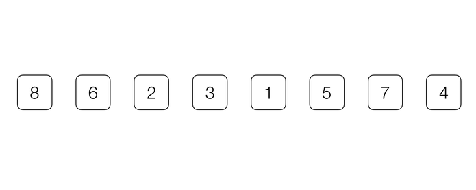

# 排序基础 -- O(n2) 的排序算法

## 为什么要学习 O(n2) 的排序算法

基础排序往往实现简单，并且通过一系列的优化，在某些特定的场合会特别适用。例如插入排序，在遇到有大量重复键值的数据时，通过优化往往可以提前终止内层循环，使算法成为一个 O(n)$ 时间复杂度的算法，这将大大提高算法的可用性，例如处理系统日志就是这样的一种问题，系统日志往往按时间有序生成，只有少数错误数据可能是乱序的，这时使用插入排序将特别高效。

另外，基础的排序算法通常还起到启发性的作用，或者作为高级排序算法的子过程，用于辅助优化一些高级排序算法 (例如：快速排序)，所以学好基础排序算法也十分必要。

## 选择排序

选择排序是一种非常简单的排序算法。简单来说，选择排序算法的步骤就是：

1. 遍历整个数组，选择最小的(或最大的)元素；
2. 与当前未排序部分的第一个元素交换位置；
3. 重复1-2，直到整个数组排序完成。

动画演示：

🔗&emsp;代码 [src/02-Sorting-Basic/01-Selection-Sort.js](../src/02-Sorting-Basic/01-Selection-Sort.js)

## 插入排序

插入排序的过程很像是为一副扑克牌排序，每抽一张牌，就为它在已经排序好的序列中，寻找一个合适的插入位置。简单来说，插入排序的算法步骤为：

1. 遍历数组，每遇到一个未排序的元素，就与以排序的部分末尾的元素比较，如果：
  a. 小于(或大于)该元素，则与之交换位置；
  b. 不大于(或不小于)该元素，则保持不变；
2. 重复直至数组有序。

动画演示:

🔗&emsp;代码 [src/02-Sorting-Basic/02-Insertion-Sort.js](../src/02-Sorting-Basic/02-Insertion-Sort.js)

### 优化

插入排序有一个显而易见的优化，就是在内层循环的每次计较后不直接交换元素位置，而是用一个临时变量保存待插入的元素，直到找到合适的插入位置，在进行实际的交换。

🔗&emsp;代码 [src/02-Sorting-Basic/03-Insertion-Sort-Enhance.js](../src/02-Sorting-Basic/03-Insertion-Sort-Enhance.js)

## (Optional) 冒泡排序

🔗&emsp;代码1 [src/02-Sorting-Basic/04-Bubble-Sort.js](../src/02-Sorting-Basic/04-Bubble-Sort.js)

🔗&emsp;代码2 [src/02-Sorting-Basic/05-Bubble-Sort-Origin.js](../src/02-Sorting-Basic/05-Bubble-Sort-Origin.js)

🔗&emsp;代码3 [src/02-Sorting-Basic/06-Bubble-Sort-Enhance.js](../src/02-Sorting-Basic/06-Bubble-Sort-Enhance.js)

## (Optional) 希尔排序

🔗&emsp;代码 [src/02-Sorting-Basic/07-Shell-Sort.js](../src/02-Sorting-Basic/07-Shell-Sort.js)
