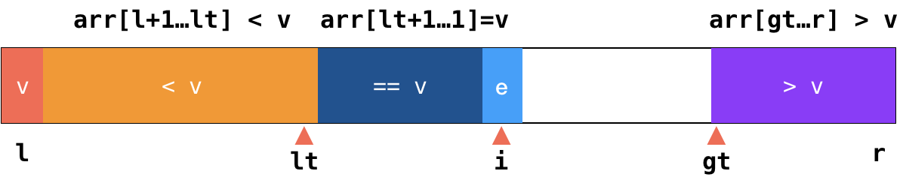

# 高级排序 -- O(nlogn) 的排序算法

## nlogn 比 n2 快多少?

|            | n2   | nlog(n) | faster |
|:----------:|:---------------:|:-------:|:------:|
| n = 10     | 100             | 33      | 3      |
| n = 100    | 1000            | 664     | 15     |
| n = 1000   | 106  | 9966    | 100    |
| n = 10000  | 108  | 132877  | 753    |
| n = 100000 | 1010 | 1660964 | 6020   |

## Merge Sort 和 Quick Sort 都使用了分治算法

> **分治算法**: 顾名思义，分而治之。即将原问题分割成同等结构的子问题，之后将子问题逐一解决后，原问题也就得到了解决。

## 归并排序

归并排序是将为大家介绍的第一个高级排序算法。归并排序使用递归过程，首先将一个数组一分为二，想办法对这两部分进行排序，然后通过**归并 (Merge)** 操作将这两部分合并起来，最后得到一个排序的数组。简单来说，归并排序的算法流程为：

1. 将一个数组一分为二，分别对两个子数组进行排序；
2. 对子数组排序时，继续将子数组分为两部分，直到每部分只有不多于 1 个元素 (并不一定，接下来会有说明)；
3. 逐级向上归并，得到排序后的数组。

动画演示:

### 归并过程

归并操作的核心是在一个相同大小的辅助空间上，分别维护两个子数组 (已经排好序)，将合适的元素放置到原数组合适的位置上。简单来说，记原数组当前要放置的元素索引位置为 `k`，两个子数组待比较的元素索引分别为 `i` 和 `j`，则归并过程的算法可以表述为：

1. 比较 `i` 与 `j` 索引位置元素的大小，将较小(或大)的元素放置到原数组索引 `k` 的位置上；
2. 重复此步骤，直到 `i` 或者 `j` 超出子数组索引范围；
3. 若子数组仍有剩余元素，则依次放置到原数组末尾，直到子数组均遍历完成。

动画演示:

🔗&emsp;代码 [src/03-Sorting-Advance/02-Merge-Sort.js](../src/03-Sorting-Advance/02-Merge-Sort.js)

稍加思索便可意识到，我们其实不必将数组细分至只有一个元素，对待一个小的数组，我们完全可以使用插入排序作为子过程来加速排序的进程：

🔗&emsp;代码 [src/03-Sorting-Advance/03-Merge-Sort-Enhanc.js](../src/03-Sorting-Advance/03-Merge-Sort-Enhanc.js)

### 自顶向下的归并排序

我们已经使用递归这种方法完成了归并操作的实现。然而在计算机上，递归操作往往需要软件保存递归过程中的堆栈信息，这在递归层数较深是会造成一定的性能浪费，模们也很容易就能写出一种不需要递归的、**自顶向下的**的归并排序算法：

🔗&emsp;代码 [src/03-Sorting-Advance/04-Merge-Sort-Bottom-Up.js](../src/03-Sorting-Advance/04-Merge-Sort-Bottom-Up.js)

## 快速排序

快速排序(简称**快排**)顾名思义，它很快；虽然平均时间复杂度仍然是 $O(nlog{n})$，但通常明显比其他算法更快。我们知道归并排序是不论数组怎么样，都一刀切的将其一分为二，然后通过归并操作逐级递归的将数组排序；而快速排序之所以快，则是引入了一个被称为**“划分 (Partition)”**的子过程，将数组拆分成具有一定性质的两部分，使得快速排序的内层循环可以相当高效的完成。

简单来说，快速排序的算法流程可以表述为：

1. 从当前数组种选择一个元素，称为**“基准 (Pivot)”**
2. 在未排序部分中为基准元素寻找合适的插入位置，并与该元素交换位置；
3. 此时数组被分为三部分：**”≤ 基准“**，**“基准”**和**“≥ 基准”**，在 **”≤ 基准“**和 **“≥ 基准”**的部分上重复 1-2，直至数组有序。

### 划分 Partition

不难看出，快速排序最核心的步骤就是其中的第 2 步 **(划分)**，也就输如何将**“基准”**元素放到它合适的位置，从而将原数组一分为三的。简单来说，通常我们选择待排序数组的第一个元素作为基准 `v`，要将数组划分为 `array[l+1...j] < v` 和 `array[j+1...i) > v`，那么划分的算法流程可以表述为：

1. 遍历数组，与基准元素比较，如果 `i` 所指的元素：
  a. 小于基准元素，则与 `j+1` 所指的元素交换位置；
  b. 不小于则继续；
2. 将基准元素 `v` 于 `j` 所指的元素交换位置。

动画演示：

不难看出，通过不断维护 `i` 和 `j` 这两个下标，我们顺利将数组分为了 `v`, `[l+1...j] < v` 和 `[j+1...i) > v` 这三部分。数组遍历完成后，`j` 下标所指的位置就是基准元素 `v` 在排好序的数组中应该所处的位置。

🔗&emsp;代码 [src/03-Sorting-Advance/05-Quick-Sort.js](../src/03-Sorting-Advance/05-Quick-Sort.js)

类似的，我们可以用部分插入排序来优化最后的小数组排序。

### 两种特殊情况

##### 几乎有序的数组

🔗&emsp;代码 [src/03-Sorting-Advance/06-Quick-Sort-Deal-With-Nearly-Ordered-Array.js](../src/03-Sorting-Advance/06-Quick-Sort-Deal-With-Nearly-Ordered-Array.js)

#### 有大量重复元素的数组

##### 双路快速排序

🔗&emsp;代码 [src/03-Sorting-Advance/07-Quick-Sort-Deal-With-Identical-Keys.js](../src/03-Sorting-Advance/07-Quick-Sort-Deal-With-Identical-Keys.js)

### 三路快速排序

三路快速排序是现在应用最为广泛的排序算法，有大量类库(无论是系统级还是应用级)的默认排序算法的实现都是用的是三路快速排序。三路快速排序对以上的特殊情况都能很好地应对，同时也十分高效。如图是三路快排的示意图：

简单来说，三路快排的划分操作可以表述为：

1. 遍历数组。记小于基准 `v` 的部分末尾下标为 `lt`，大于 `v` 的部分首位元素为 `gt`，当前访问元素下标为 `i`，如果 `i` 所指元素：
  a. 小于 `v`，则与 `lt+1` 所指元素交换位置，同时使 `lt++`；
  b. 大于 `v`，则与 `gt-1` 所指元素交换位置，同时使 `gt--`；
  c. 等于 `v`则继续；
2. 重复直到 `i == gt`。

🔗&emsp;代码 [src/03-Sorting-Advance/08-Quick-Sort-Three-Ways.js](../src/03-Sorting-Advance/08-Quick-Sort-Three-Ways.js)
