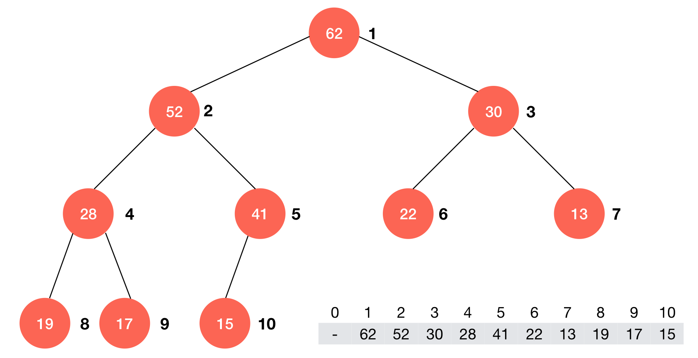
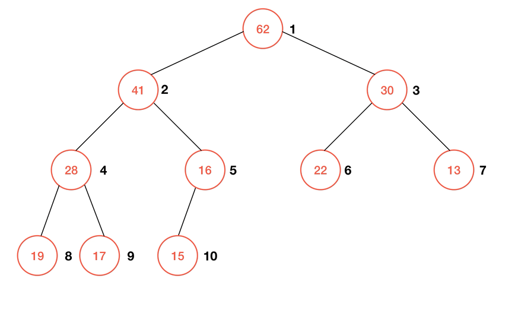
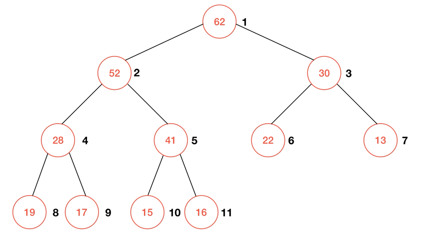

# 堆排序 Heap Sort

## 堆和优先队列 Heap and Priority Queue

### 什么是优先队列?

**普通队列**: 先进先出, 后进后出<br>
**优先队列**: 出队顺序和入队顺序无关, 与优先级相关

### 为什么使用优先队列?

```
                    +---------+
                +---| Request |
+------------+  |   +---------+
| 任务处理中心 |--+---···
+------------+  |   +---------+
                +---| Request |
                    +---------+
```

### 优先队列主要操作

- 入队
- 出队 (取出优先级最高的元素)

### 优先队列的实现

|         | 入队      | 出队     |
|:-------:|:--------:|:--------:|
| 普通队列 | O(1)     | O(n)     |
| 顺序数组 | O(n)     | O(1)     |
| 堆      | O(*lg*n) | O(*lg*n) |

### 使用堆实现优先队列

使用普通数组或顺序数组，最差情况：O(n<sup>2</sup>)<br>
使用堆: O(lgn)

### 堆的实现

#### 二叉堆 Binary Heap

- **堆**总是一棵[**完全树**](https://zh.wikipedia.org/wiki/%E5%AE%8C%E5%85%A8%E4%BA%8C%E5%8F%89%E6%A0%91)。即除了最底层，其他层的节点都被元素填满，而最底层则尽可能地从左到右填入；
- **堆序性**：任意节点小于(或大于)它的所有子节点，且根节点为最小或最大的元素。

根据堆序性，又将根节点为最大元素的堆称为**最大堆**，根节点为最小元素的堆称为**最小堆**。



> 二叉堆示意图

🔗&emsp;代码 [src/04-Heap/02-Max-Heap-Class-Basic.js](../src/04-Heap/02-Max-Heap-Class-Basic.js)

##### 入队 Shift Up

动画演示:



🔗&emsp;代码 [src/04-Heap/03-Shift-Up.js](../src/04-Heap/03-Shift-Up.js)

##### 出队 Shift Down

动画演示:



🔗&emsp;代码 [src/04-Heap/04-Shift-Down.js](../src/04-Heap/04-Shift-Down.js)

#### 索引堆 Index Max Heap

> TODO

# 排序总结

> TODO

## 排序算法的稳定性

**稳定排序**: 对于相等的元素，在排序后，原来靠前的元素依然靠前。即相等元素的相对位置没有发生改变。

⚠️ **注意** 可以通过自定义比较函数，让不稳定的排序算法变得稳定：

```c++
bool operator<(const T &another)
{
  return prop != other.prop ?
    prop > other.prop :
    name < other.name;
}
```
