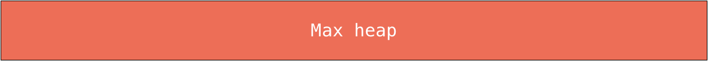
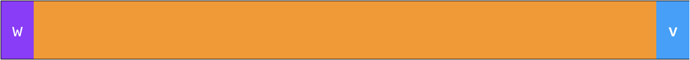
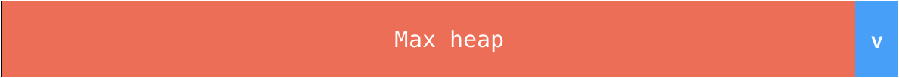
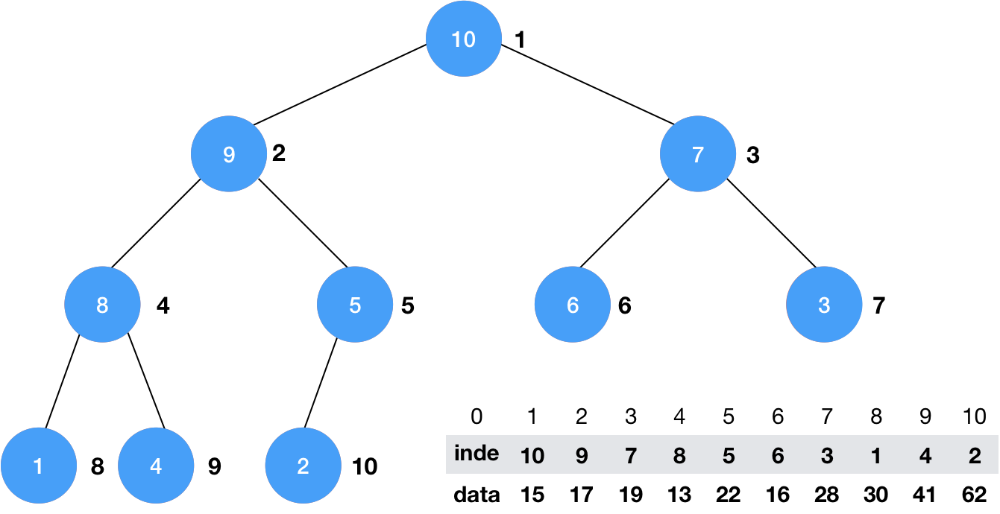
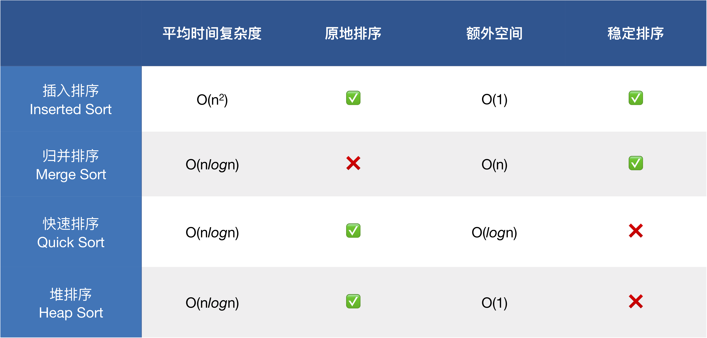

# 堆排序 Heap Sort

## 堆和优先队列 Heap and Priority Queue

### 什么是优先队列?

**普通队列**: 先进先出, 后进后出<br>
**优先队列**: 出队顺序和入队顺序无关, 与优先级相关

### 为什么使用优先队列?

```
                    +---------+
                +---| Request |
+------------+  |   +---------+
| 任务处理中心 |--+---···
+------------+  |   +---------+
                +---| Request |
                    +---------+
```

### 优先队列主要操作

- 入队
- 出队 (取出优先级最高的元素)

### 优先队列的实现

|         | 入队      | 出队     |
|:-------:|:--------:|:--------:|
| 普通队列 | O(1)     | O(n)     |
| 顺序数组 | O(n)     | O(1)     |
| 堆      | O(*lg*n) | O(*lg*n) |

### 使用堆实现优先队列

使用普通数组或顺序数组，最差情况：O(n<sup>2</sup>)<br>
使用堆: O(lgn)

### 堆的实现

#### 二叉堆 Binary Heap

- **堆**总是一棵[**完全树**](https://zh.wikipedia.org/wiki/%E5%AE%8C%E5%85%A8%E4%BA%8C%E5%8F%89%E6%A0%91)。即除了最底层，其他层的节点都被元素填满，而最底层则尽可能地从左到右填入；
- **堆序性**：任意节点小于(或大于)它的所有子节点，且根节点为最小或最大的元素。

根据堆序性，又将根节点为最大元素的堆称为**最大堆**，根节点为最小元素的堆称为**最小堆**。


> 二叉堆示意图

🔗&emsp;代码 [src/04-Heap/02-Max-Heap-Class-Basic.js](../src/04-Heap/02-Max-Heap-Class-Basic.js)

##### 入队 Shift Up

动画演示:


🔗&emsp;代码 [src/04-Heap/03-Shift-Up.js](../src/04-Heap/03-Shift-Up.js)

##### 出队 Shift Down

动画演示:


🔗&emsp;代码 [src/04-Heap/04-Shift-Down.js](../src/04-Heap/04-Shift-Down.js)

#### 原地成堆 Heapify

简单来说，`Heapify` 的算法过程可以简述为:

1. 从最后一个非叶子结点开始向前遍历数组；
2. 每遇到一个非叶子结点，就通过 `shiftDown` 使以当前节点为根结点的子树成最大堆；
3. 重复直到根节点完成 `shiftDown`。

动画演示:


🔗&emsp;代码 [src/04-Heap/05-Heapify.js](../src/04-Heap/05-Heapify.js)

##### 原地堆排序

无论是将元素逐一插入空堆还是通过 `Heapify` 来使数组成堆，实际上都开辟了一个堆的空间 (也就是使用了额外的 $O(n)$ 的空间复杂度)。但结合上面 `Heapify` 的思想，也可以很容易的改造堆排序的过程，使数组原地完成堆排序的操作。



> 一个已经形成最大堆的数组

假定通过 `Heapify` 已经使一个数组形成最大堆，这时数组中第一个元素也就是最大的元素，要是数组从小到大排序，只需使现在数组第一个位置的元素与最后一个元素交换位置：



而此时由于 `w` 并不一定是最大元素，也就使得原有最大堆的性质遭到了破坏。这时只需通过对 `w` 元素进行一次 `shiftDown` 操作，就能使数组的前部重新形成最大堆：



那么重复上述操作就可以使整个数组完成排序。

🔗&emsp;代码 [src/04-Heap/06-Heap-Sort.js](../src/04-Heap/06-Heap-Sort.js)

#### 索引堆 Index Max Heap



> 索引最大堆示意图

🔗&emsp;代码 [src/04-Heap/08-Index-Heap.js](../src/04-Heap/08-Index-Heap.js)

# 排序总结



> 4 大重要排序算法比较

我们主要学习的就是上图 4 种基于比较的排序算法。除了插入排序复杂度为 $O(n^2)$ 以外，其余几种排序算法复杂度均为 $O(nlog{n})$，但这也并不是说明插入排序不好，事实上我们在测试中可以发现在完全有序的数组上插入排序的复杂度退化为 $O(n)$，甚至优于同等的高级排序算法。这说明我们在编程开发时应学会结合实际情况，选择最优的排序算法，而不是只会做一个 `API caller`。

## 排序算法的稳定性

**稳定排序**: 对于相等的元素，在排序后，原来靠前的元素依然靠前。即相等元素的相对位置没有发生改变。

⚠️ **注意** 可以通过自定义比较函数，让不稳定的排序算法变得稳定：

```c++
bool operator<(const T &another)
{
  return prop != other.prop ?
    prop > other.prop :
    name < other.name;
}
```
