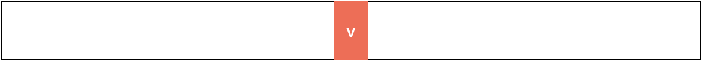
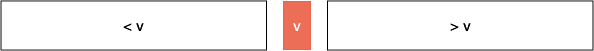
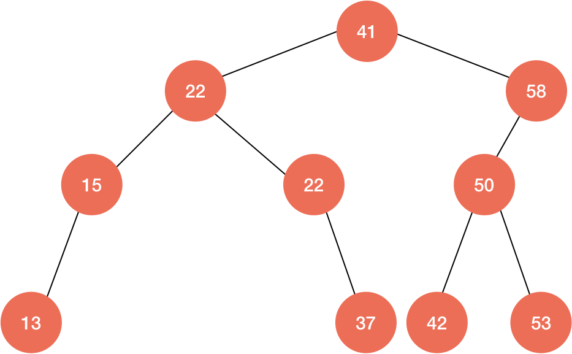

# 二叉搜索树 Binay Search Tree

在前面的几节中我为大家介绍了四种经典的排序算法，尤其重点介绍了三种高级排序算法。而接下来这一小节将为大家介绍另一种数据结构：**二分搜索树**。二叉搜索树被广泛应用在解决**查找问题**上，其本质上还是一棵**二叉树**，这和前面我们已经学习过的**最大堆**有些类似，但又有一些本质上的不同。事实上，二叉树是计算机算法中应用非常广泛的的一种数据结构，不同类型的二叉树能很好的应用于各类问题。

## 搜索问题 Searching Problem

**查找问题是计算机中非常重要的基础问题**

## 二分查找法 Binary Search

对于有序数列才能使用二分查找 (排序的作用)

> 二分查找法的思想在 1946 年被提出 
> 第一个没有 bug 的二分查找法在 1962 年才被实现

### 使用递归的方法实现二分查找

**优点**: 递归实现通常思维起来更容易。 
**缺点**: 递归在性能上略差。

二分查找(又称**折半查找**)只能应用在有序的数组上，因为我们处理有序数组比处理无序数组要方便得多。这也可以看出我们前面学习那么多排序算法的原因：很多时候排序算法都是作为其他算法的子过程来使用的。

假定一个数组有序数组，要查找元素值为 `e`，这是只需与数组中间的值 `v` 进行比较：

如果 `e` 正好等于 `v`，那么 `v` 显然就是我们要找的元素；否则，以 `v` 为界数组将分为 `< v`、`v`、`> v` 三部分：

🔗&emsp;代码 [src/05-Binary-Search-Tree/01-Binary-Search.js](../src/05-Binary-Search-Tree/01-Binary-Search.js)

## 二分搜索树的优势

不难想到，树型的结构将总是提供 $O(log{n})$ 的复杂度

### 查找表的实现 -- 字典数据结构

| key  | value  |
|:----:|:------:|
| key1 | value1 |
| key2 | value2 |
| key3 | value3 |
| key4 | value4 |
| key5 | value5 |
| key6 | value6 |
| key7 | value7 |
| key8 | value8 |
| key9 | value9 |

### 二分搜索树

|           | 查找元素 | 插入元素 | 删除元素 |
|:---------:|:-------:|:-------:|:------:|
| 普通数组   | O(n)    | O(n)    | O(n)   |
| 顺序数组   | O(logn) | O(n)    | O(n)   |
| 二分搜索树 | O(logn) | O(logn) | O(logn) |

高效：不仅可以查找数据；还可以高效的插入、删除数据 —— 动态维护数据；
可以方便的回答很多数据之间的关系问题：

- min, max, floot, ceil, rank, select

#### 性质

二分搜索树本质上还是一科二叉树，同时又具有一些特殊的性质：

1. 任意节点的左子树总是小于当前节点的值；
2. 任意节点的右子树总是大于当前节点的值；
3. 没有键值相等的节点。

显然，由于树的递归性质，那么只要一个节点有左(右)子树，那么它的左(右)肯定也是一棵二分搜索树。

> 二分搜索树示意图

🔗&emsp;代码 [src/05-Binary-Search-Tree/02-Binary-Search-Tree-Basics.js](../src/05-Binary-Search-Tree/02-Binary-Search-Tree-Basics.js)

#### 插入元素

简单来说，记带插入元素 `s` 为 `(k, v)`，插入元素的算法流程可以表述为：

1. 若带插入的树根节点 `node` 为空，则将带插入元素作为根节点插入；否则：
2. 若 `k` 等于 `node.key`，则更新 `node.value` 为 `v`；否则：
3. 若 `k` 小于 `node.key`，则将带 `s` 插入到 `node` 的左子树中；否则：
4. 将 `s` 插入到 `node` 的右子树中。

动画演示：

🔗&emsp;代码 [src/05-Binary-Search-Tree/03-Binary-Search-Tree-Insert.js](../src/05-Binary-Search-Tree/03-Binary-Search-Tree-Insert.js)

#### 查找元素

简单来说，在以 `node` 为根节点的二分搜索树中查找一个元素 `v` 的算法过程可以简述为：

1. 若 `node` 为空则查找失败；否则：
2. 若 `v` 等于 `node.value` 则查找成功；否则：
3. 若 `v` 小于 `node.value`，则搜索左子树；否则：
4. 重复 `1-4`，搜索右子树。

🔗&emsp;代码 [src/05-Binary-Search-Tree/04-Binary-Search-Tree-Search.js](../src/05-Binary-Search-Tree/04-Binary-Search-Tree-Search.js)

#### 遍历元素

> TODO

##### 深度优先遍历

> TODO

###### 前序遍历

> TODO

###### 中序遍历

> TODO

###### 后序遍历

> TODO

##### 广度优先遍历

> TODO

###### 层序遍历

> TODO

#### 删除元素

> TODO

##### 最小值和最大值

> TODO

##### 任意元素

> TODO
